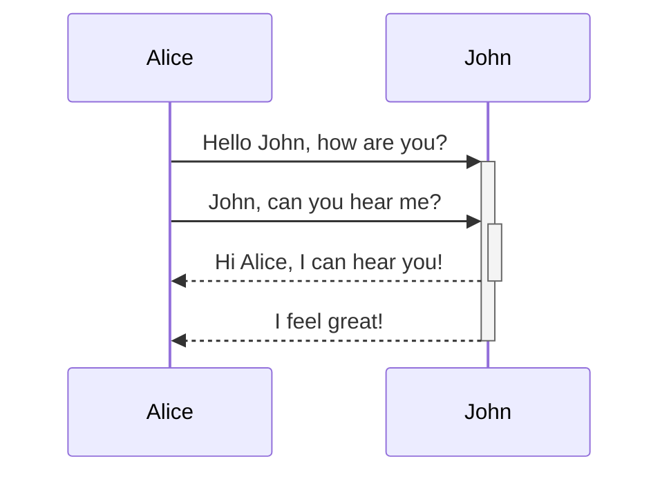
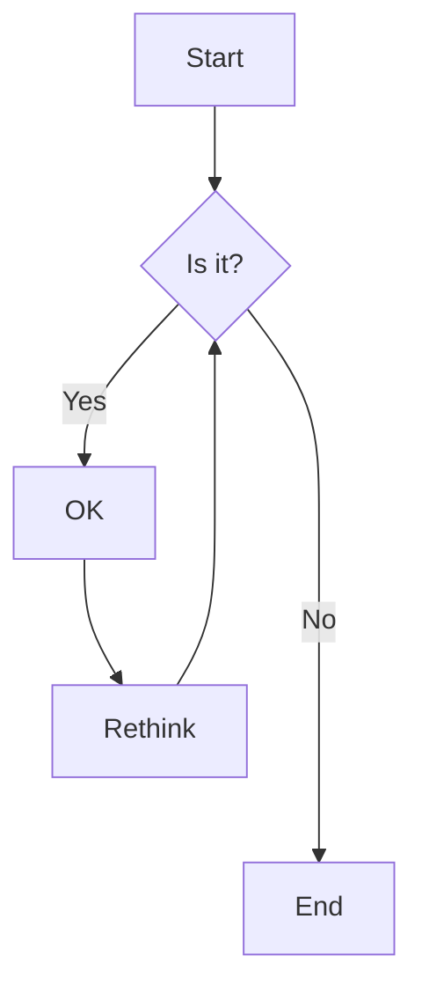
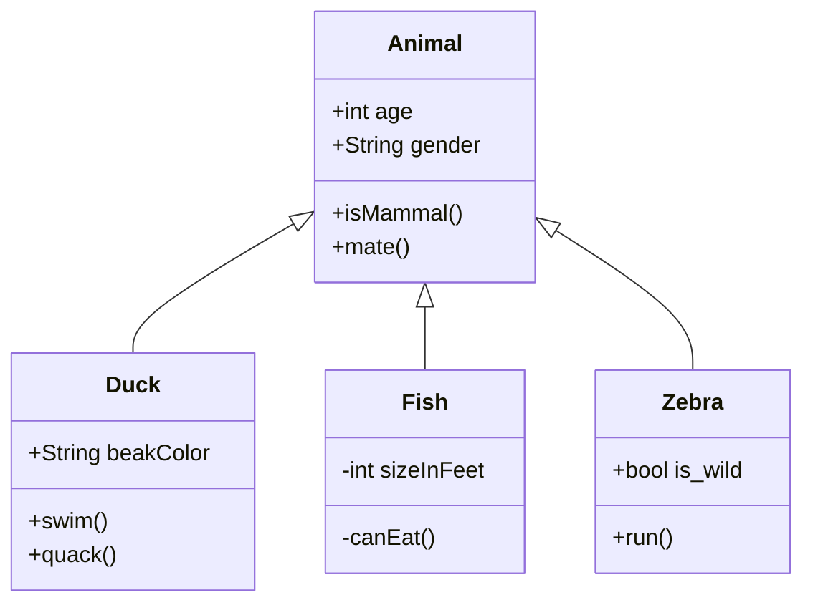
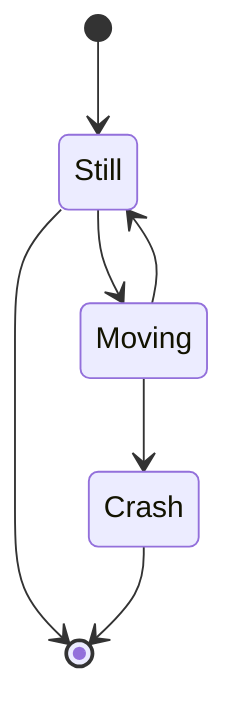

Quartz supports Mermaid which allows you to add diagrams and charts to your notes. Mermaid supports a range of diagrams, such as [flow charts](https://mermaid.js.org/syntax/flowchart.html), [sequence diagrams](https://mermaid.js.org/syntax/sequenceDiagram.html), and [timelines](https://mermaid.js.org/syntax/timeline.html). This is enabled as a part of [[Obsidian compatibility]] and can be configured and enabled/disabled from that plugin.

By default, Quartz will render Mermaid diagrams to match the site theme.

> [!warning]
> Wondering why Mermaid diagrams may not be showing up even if you have them enabled? You may need to reorder your plugins so that [[ObsidianFlavoredMarkdown]] is _after_ [[SyntaxHighlighting]].

## Syntax

To add a Mermaid diagram, create a mermaid code block.

````

````


## Flowchart



## Sequence Diagram


## Class Diagram



## State Diagram



## Regular code block (should not be rendered)

```javascript
const x = 1;
const y = 2;
console.log(x + y);
```

## Inline code should also not be affected

This is `code` and this is more `code with $math$` but not mermaid.